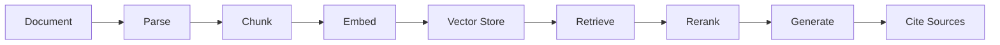

# RAG Knowledge System

A retrieval-augmented generation system for ingesting, indexing, retrieving and answering questions from documents with source citations.

## Status

Under active development.

## Project Goals

This project will explore:

- document ingestion and parsing
- metadata-aware chunking
- embedding and vector retrieval
- hybrid retrieval and reranking
- source-grounded responses
- retrieval evaluation
- structured outputs
- API deployment and testing

## Architecture

Planned high-level flow:

## Architecture

