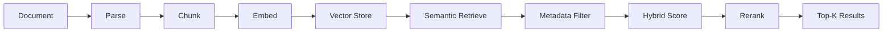

# RAG Knowledge System

A retrieval-augmented generation system for ingesting, indexing, retrieving and answering questions from documents with source citations.

## Public Repository Note

This repository is a sanitised and re-engineered public implementation derived from patterns used in private local-first projects.

The original implementations contain organisation-specific workflows, private operational data, credentials, local infrastructure details, and environment-specific integrations that are not suitable for public release.

This public version therefore reconstructs the core engineering patterns using synthetic or publicly available sample data. The focus is on demonstrating transferable architecture and engineering practices, including ingestion, chunking, embedding, retrieval, filtering, reranking, testing, and reproducibility.

The public repository is not intended to reproduce the private production environment or its data.

## Status

Core retrieval pipeline implemented.

Current capabilities:

- validated text and Markdown ingestion
- character, word, token and paragraph-aware chunking
- Hugging Face sentence embeddings
- in-memory vector storage
- cosine similarity search
- metadata filtering
- top-k semantic retrieval
- hybrid semantic and keyword retrieval
- second-stage reranking
- end-to-end retrieval pipeline
- automated tests

## Project Goals

## Implemented

- document ingestion and parsing
- metadata-aware chunking
- embedding and vector retrieval
- metadata filtering
- hybrid retrieval
- reranking
- automated testing

## Roadmap

- retrieval evaluation
- source-grounded generation
- structured outputs
- FastAPI deployment
- Docker packaging

## Architecture

